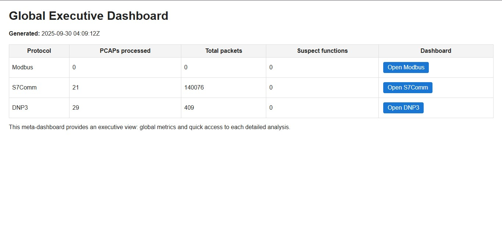
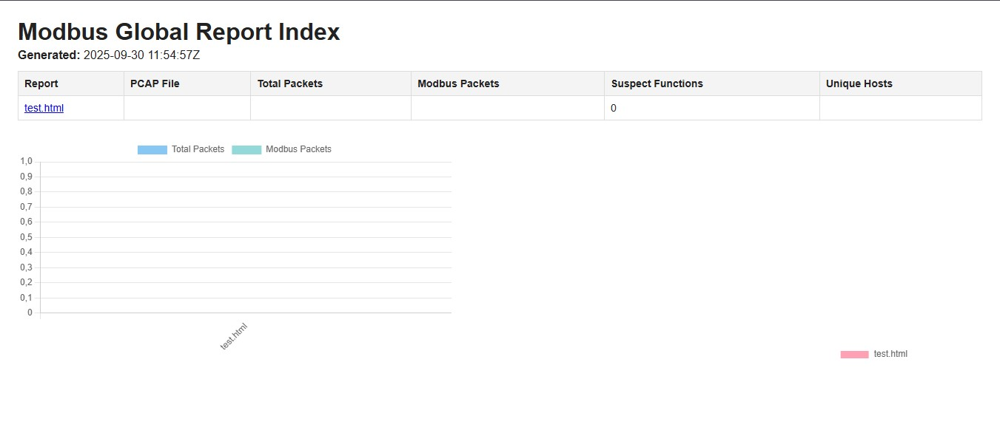
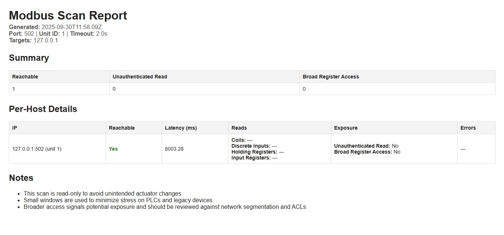
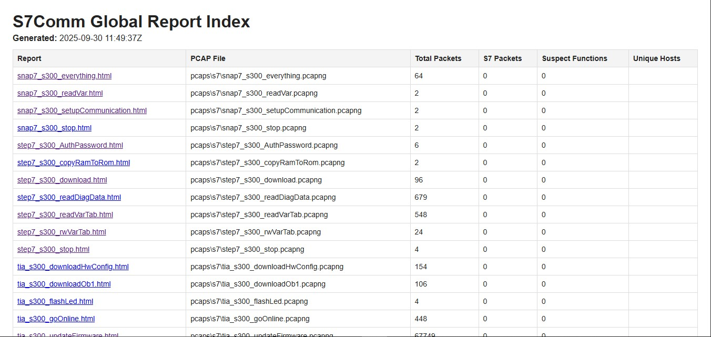
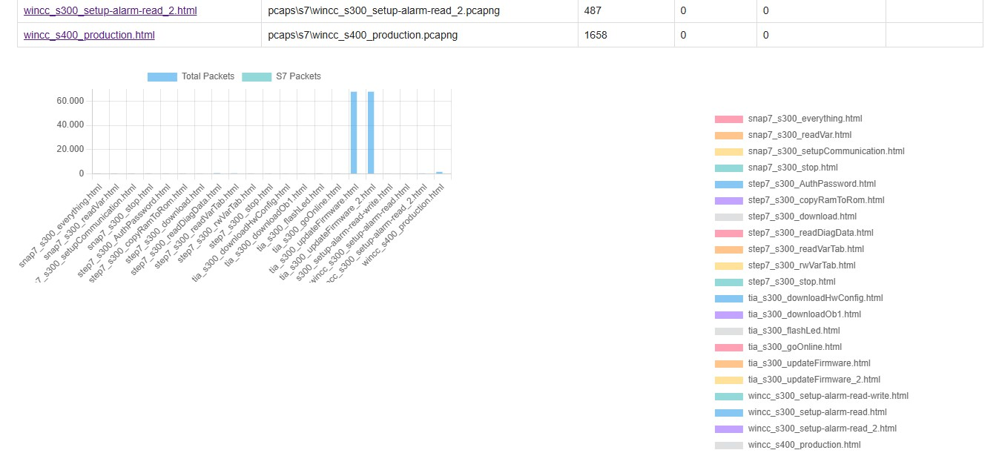
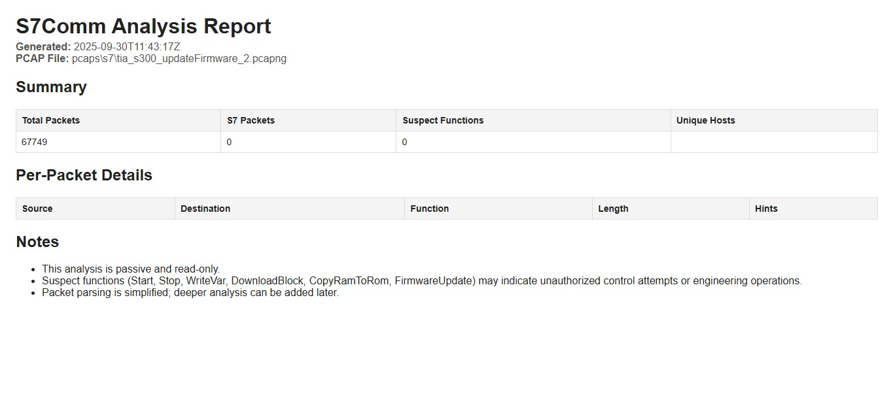
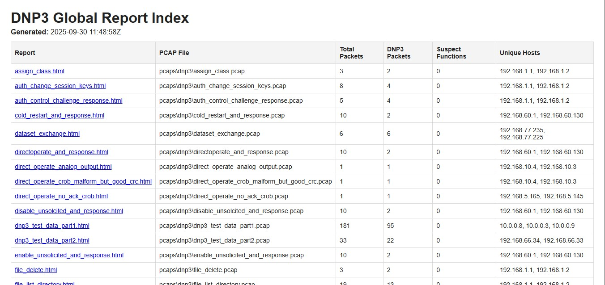
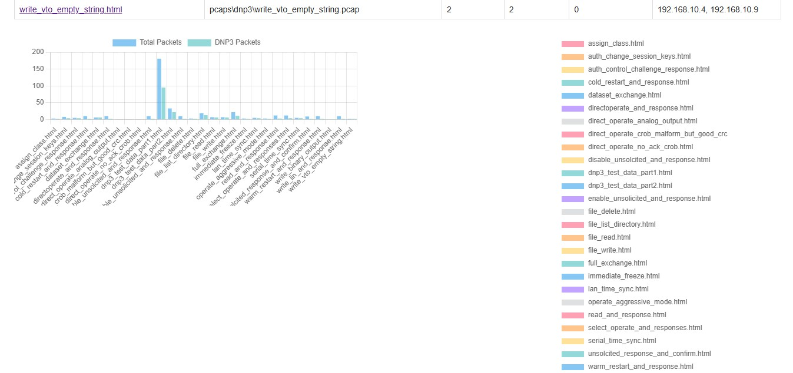
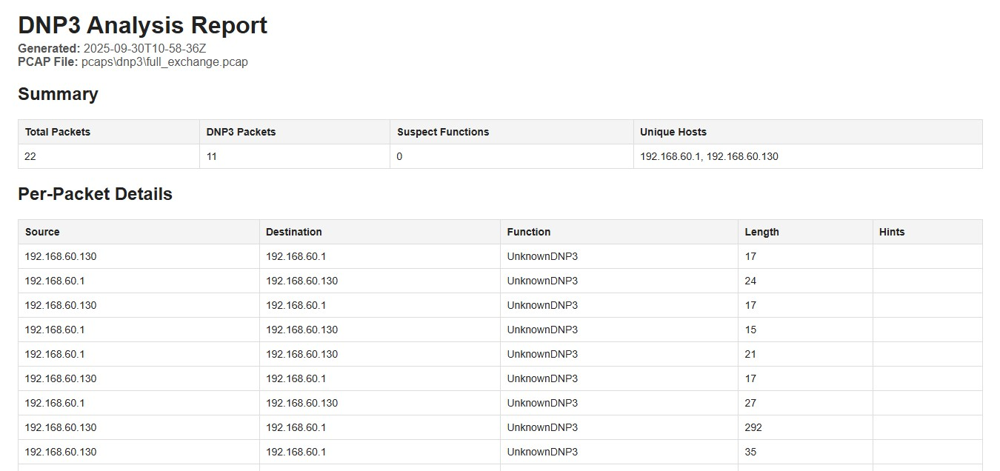

```markdown
# IndustrialScanner-Lite

[](https://www.python.org/)
[](LICENSE)

---

## 📌 Introduction

**IndustrialScanner-Lite** is a modular cybersecurity and automation toolkit designed for **Industrial Control Systems (ICS)** and **Operational Technology (OT)** environments.  
These systems are the backbone of **power substations, manufacturing plants, water treatment facilities, and critical infrastructure**, where specialized communication protocols such as **Modbus/TCP, Siemens S7Comm, and DNP3** are used instead of traditional IT protocols.

Unlike conventional IT networks, ICS/OT environments prioritize **availability and safety** over speed or convenience. A single misconfiguration or malicious command can disrupt production lines, shut down substations, or compromise operator safety.  

This project addresses that challenge by providing a **safe, read‑only, and automated analysis suite** that:

- ✅ Scans and simulates industrial devices (e.g., **ModbusPal** for Modbus/TCP).  
- ✅ Processes **packet captures (PCAPs)** from real ICS traffic for S7Comm and DNP3.  
- ✅ Generates standardized **JSON and HTML reports** for forensic and compliance use.  
- ✅ Builds **executive dashboards** with consolidated metrics and visualizations for quick decision‑making.  

The goal is to **bridge the gap between cybersecurity practices and industrial automation realities**, giving professionals and recruiters a clear view of how modern security tooling can be adapted to protect critical infrastructure systems.

---

## 🚀 Quickstart

```bash
# Clone repository
git clone https://github.com/<frangelbarrera>/IndustrialScanner-Lite.git
cd IndustrialScanner-Lite

# Install dependencies
pip install -r requirements.txt

# Example: Run a Modbus scan (with ModbusPal)
python -m modbus_scanner.modbus_scan --targets 127.0.0.1 --unit 1

# Example: Process S7 PCAPs and build dashboard
python run_dnp3_all.py
python build_s7_index.py
```

Dashboards will be generated in the `reports/` folder as HTML files.

---

## 📦 Features and Modules

| Module | Purpose | Input type | Output | Run style |
|---|---|---|---|---|
| `modbus_scanner` | Active, read-only Modbus/TCP scanner (safe probes) | Live targets (IP/port), ModbusPal | JSON + HTML | Python CLI |
| `s7_comm_analyzer` | Passive analyzer for S7Comm traffic | PCAP files | JSON + HTML | Batch runner + Python |
| `dnp3_monitor` | Passive analyzer for DNP3 traffic | PCAP files | JSON + HTML | Batch runner + Python |
| `build_*_index.py` | Per-protocol dashboards with charts | Folder of JSON reports | HTML dashboard | Python script |
| `build_global_index.py` | Minimal executive meta-dashboard | Per-protocol indices | HTML dashboard | Python script |

> The suite intentionally separates **“report generation”** from **“dashboard building.”**  
> Scanners/analyzers produce per-file reports. Index builders read those reports and create consolidated views.

---

## 📂 Project Structure

```text
IndustrialScanner-Lite/
├─ modbus_scanner/
│  ├─ modbus_scan.py         # Active read-only scanner
│  └─ utils.py
├─ s7_comm_analyzer/
│  ├─ s7_analyze.py          # PCAP → JSON/HTML reports
│  └─ parsers.py
├─ dnp3_monitor/
│  ├─ dnp3_analyze.py        # PCAP → JSON/HTML reports
│  └─ parsers.py
├─ pcaps/                    # Sample PCAPs for testing
│  ├─ s7/
│  ├─ dnp3/
│  └─ modbus/
├─ reports/                  # JSON + HTML outputs
│  ├─ modbus_batch/
│  ├─ s7_batch/
│  ├─ dnp3_batch/
│  ├─ templates/
│  ├─ modbus_index.html
│  ├─ s7_index.html
│  ├─ dnp3_index.html
│  └─ index.html
├─ docs/images/              # Screenshots for README
├─ build_modbus_index.py
├─ build_s7_index.py
├─ build_dnp3_index.py
├─ build_global_index.py
└─ requirements.txt
```

---

## 🖼️ Screenshots

### 🌍 Global Executive Dashboard


---

### 🔌 Modbus
**Global Dashboard**


**Individual Report**


---

### 🏭 Siemens S7Comm
**Global Dashboard**
  


**Individual Report**


---

### ⚡ DNP3
**Global Dashboard**
  


**Individual Report**


---

## ⚙️ Setup and Prerequisites

- **Python:** 3.11 (recommended).  
- **Dependencies:** Install from `requirements.txt`.  
  ```bash
  pip install -r requirements.txt
  ```
- **Folder conventions:**
  - Modbus reports → `reports/modbus_batch/`  
  - S7 reports → `reports/s7_batch/`  
  - DNP3 reports → `reports/dnp3_batch/`  
- **Templates:** Jinja2 templates live in `reports/templates/`.

> Tip: Keep protocol inputs and outputs in their dedicated batch folders to maintain a clean, professional, and scalable structure.

---

## 📊 Usage by Protocol

### Modbus (active, read-only)
```bash
python -m modbus_scanner.modbus_scan --targets 127.0.0.1 --port 502 --unit 1
```
- Outputs JSON + HTML in `reports/modbus_batch/`.  
- Safe probes: coils, discrete inputs, registers.  
- Includes latency and exposure signals.  

### S7Comm (passive, from PCAPs)
```bash
run_s7_all.bat
python build_s7_index.py
```
- Outputs per-PCAP JSON/HTML in `reports/s7_batch/`.  
- Consolidated dashboard: `reports/s7_index.html`.  

### DNP3 (passive, from PCAPs)
```bash
run_dnp3_all.bat
python build_dnp3_index.py
```
- Outputs per-PCAP JSON/HTML in `reports/dnp3_batch/`.  
- Consolidated dashboard: `reports/dnp3_index.html`.  

### Global Executive Dashboard
```bash
python build_global_index.py
```
- Produces `reports/index.html` with totals and quick links.

---

## 🧪 Test Data

The repository includes:
- **Sample PCAPs** for S7Comm and DNP3 (under `pcaps/`).  
- **ModbusPal** JAR file for Modbus/TCP emulation.  

This allows you to test the toolkit immediately without external dependencies.

---

## ✅ Best Practices

- **Safety-first:** Modbus scanner is read-only. Never run against production PLCs.  
- **Consistency:** Keep outputs in `reports/<protocol>_batch/`.  
- **Charts:** Dashboards use Chart.js from CDN.  
- **Version control:** Add generated reports to `.gitignore` unless you want to showcase sample outputs.  
- **Recruiter-ready:** Screenshots in `docs/images/` demonstrate dashboards visually.  

---


