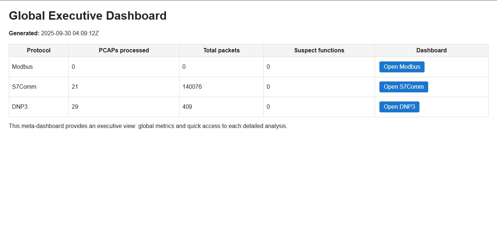
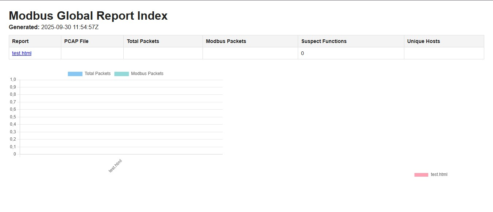
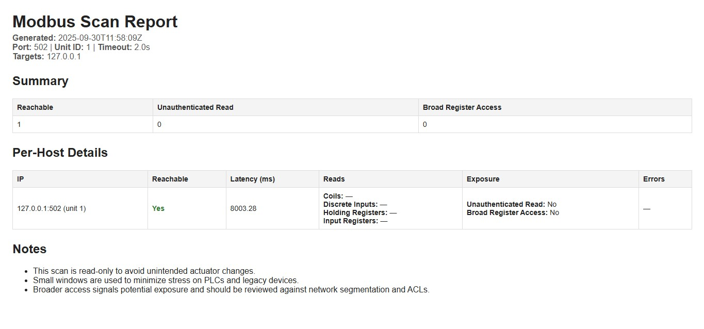
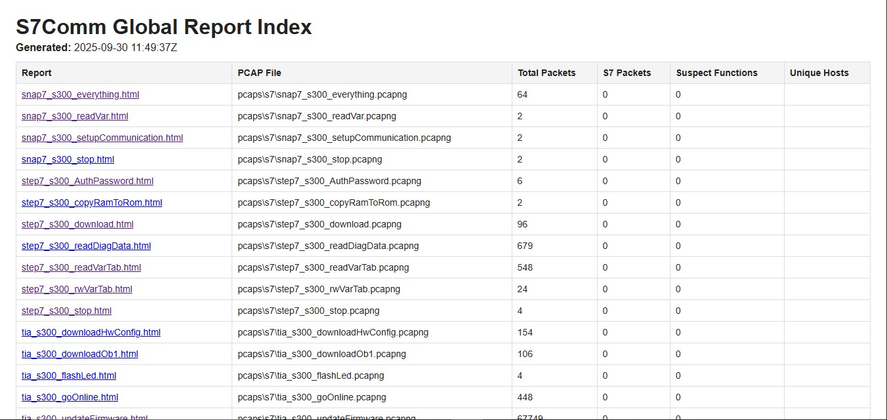
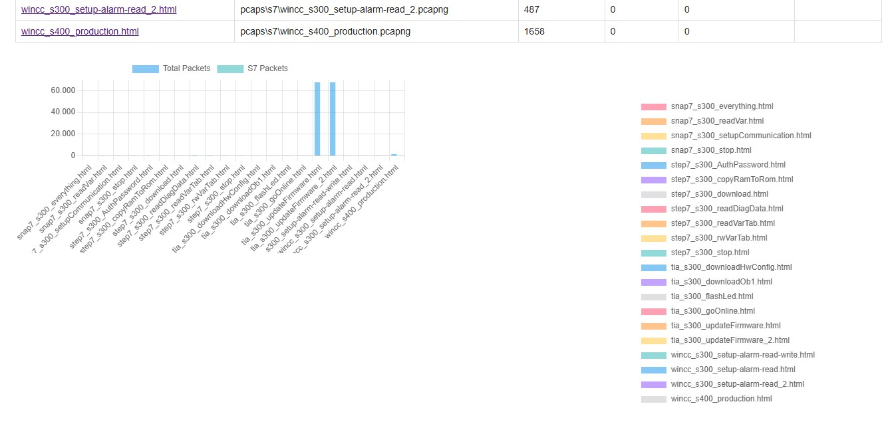
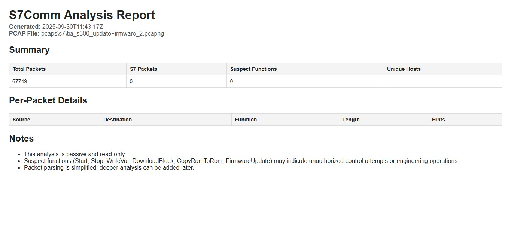
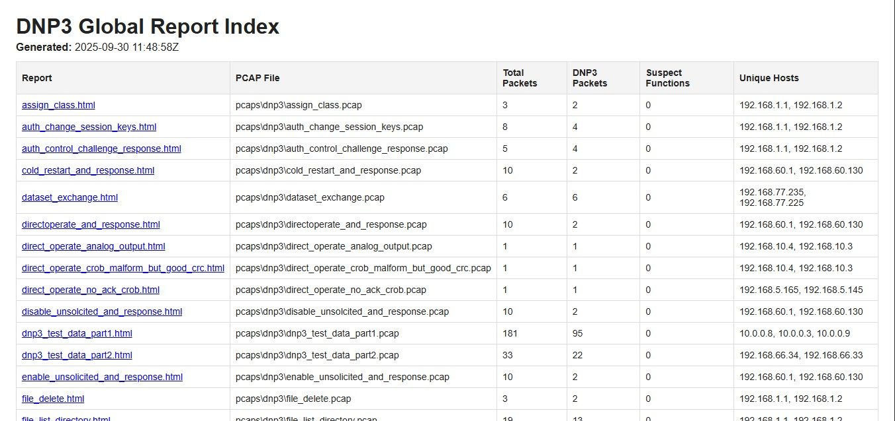
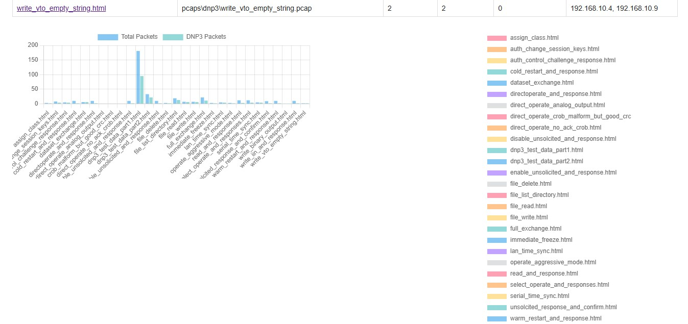
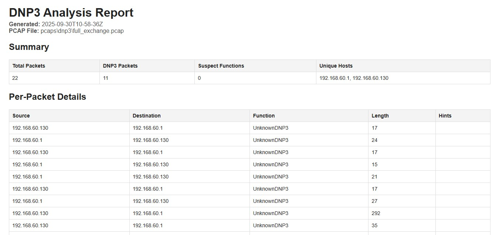

<div align="center">

# IndustrialScanner-Lite

**Read-only security analyzer for Industrial Control Systems (ICS) / Operational Technology (OT)**

Modbus/TCP &middot; Siemens S7Comm &middot; DNP3

</div>

---

[](LICENSE)
[](https://github.com/frangelbarrera/IndustrialScanner-Lite/actions)
[](https://www.python.org/downloads/)
[](https://docs.astral.sh/ruff/)
[](https://pytest.org)
[](https://github.com/PyCQA/bandit)
[](https://github.com/frangelbarrera/IndustrialScanner-Lite/stargazers)
[](https://github.com/frangelbarrera/IndustrialScanner-Lite/commits)
[](https://github.com/frangelbarrera/IndustrialScanner-Lite/issues)

> ⚠️ **Read-only research / education tool.** Never deploy against production OT environments without explicit written authorization. See [`SECURITY.md`](SECURITY.md) and the [Safe Harbor](SECURITY.md#safe-harbor) section.

---

## What it does

IndustrialScanner-Lite gives OT/ICS security practitioners a **safe, read-only, automated analysis suite** for the three most common industrial protocols:

| Module | Protocol | Mode | Output |
|---|---|---|---|
| `modbus_scanner` | Modbus/TCP (port 502) | Active read-only probe (coils, inputs, registers) | JSON + HTML |
| `s7_comm_analyzer` | Siemens S7Comm (TPKT/COTP, port 102) | Passive PCAP analysis | JSON + HTML |
| `dnp3_monitor` | DNP3 (TCP/UDP 20000) | Passive PCAP analysis | JSON + HTML |
| `build_*_index.py` | All three | Consolidated dashboard | HTML + Chart.js |

The suite is intentionally split into **report generation** (scanners/analyzers) and **dashboard building** (index builders). Scanners produce per-target reports; index builders aggregate them into executive dashboards.

---

## Why it exists

ICS/OT networks are not regular IT networks. They prioritize **availability and safety** over speed and convenience, and they use specialized protocols that traditional security tooling ignores. A single misconfiguration can halt a substation, a production line, or a water treatment plant.

Commercial ICS/OT tooling (Claroty, Nozomi, Dragos) is excellent but expensive and closed-source. IndustrialScanner-Lite closes that gap by giving practitioners, researchers, and educators a transparent, auditable, and free toolkit to understand the security posture of their OT assets.

---

## Quickstart

```bash
# 1. Clone
git clone https://github.com/frangelbarrera/IndustrialScanner-Lite.git
cd IndustrialScanner-Lite

# 2. Install
python -m venv .venv && source .venv/bin/activate
pip install -e ".[dev]"

# 3. Copy env template (optional for read-only analysis)
cp .env.example .env

# 4. Run a Modbus scan (read-only, safe probes)
ics-scan modbus --targets 127.0.0.1 --unit 1
# or
python -m modbus_scanner.modbus_scan --targets 127.0.0.1 --unit 1

# 5. Analyze S7Comm PCAPs
python run_dnp3_all.py    # processes all PCAPs in pcaps/dnp3/
python build_s7_index.py  # builds consolidated dashboard

# 6. Global executive dashboard
python build_global_index.py
```

Outputs land in `reports/` as HTML dashboards with Chart.js visualizations.

---

## Repository layout

```text
IndustrialScanner-Lite/
├─ modbus_scanner/        # Active read-only Modbus/TCP scanner
│  ├─ modbus_scan.py
│  └─ utils.py
├─ s7_comm_analyzer/      # Passive S7Comm analyzer
│  ├─ s7_analyze.py
│  └─ parsers.py
├─ dnp3_monitor/           # Passive DNP3 analyzer
│  ├─ dnp3_analyze.py
│  └─ parsers.py
├─ ics_scanner/            # Shared security primitives (NEW)
│  ├─ security.py          # HTML escape, target policy, path guards
│  └─ cli.py               # Unified Click+Rich CLI
├─ reports/
│  ├─ modbus_batch/
│  ├─ s7_batch/
│  ├─ dnp3_batch/
│  ├─ templates/           # Jinja2 templates (autoescape on)
│  ├─ modbus_index.html
│  ├─ s7_index.html
│  ├─ dnp3_index.html
│  └─ index.html
├─ tests/                  # pytest + property-based tests (NEW)
├─ .github/workflows/      # CI, release, dependency scan (NEW)
├─ pcaps/                  # Sample PCAPs
├─ docs/images/            # Screenshots
├─ cli.py                  # Legacy CLI (kept for compatibility)
├─ build_*.py              # Dashboard builders
├─ pyproject.toml          # Modern packaging (PEP 621)
├─ .pre-commit-config.yaml # Ruff + mypy + bandit hooks
└─ .env.example            # Environment template
```

---

## Unified CLI (new)

The new Click+Rich based CLI lives in `ics_scanner/cli.py`. Install exposes the `ics-scan` entry point:

```bash
ics-scan modbus --targets 192.168.0.10,192.168.0.11 --unit 1
ics-scan s7 --pcap pcaps/s7/step7_s300_stop.pcapng
ics-scan dnp3 --pcap pcaps/dnp3/read_and_response.pcap
```

The CLI enforces a **target safety policy**: public IPs are refused by default (use `--allow-public` only after explicit written authorization). This prevents accidental wide-area scanning of legacy PLCs.

---

## Usage by protocol

### Modbus (active, read-only)

```bash
python -m modbus_scanner.modbus_scan --targets 127.0.0.1 --port 502 --unit 1
# or
ics-scan modbus --targets 127.0.0.1 --port 502 --unit 1
```

- Issues **only read function codes**: `0x01 Read Coils`, `0x02 Read Discrete Inputs`, `0x03 Read Holding Registers`, `0x04 Read Input Registers`.
- Collects latency, exposure signals (`unauthenticated_read`, `broad_register_access`).
- Outputs JSON + HTML in `reports/modbus_batch/`.

### S7Comm (passive, from PCAPs)

```bash
python run_s7_all.bat          # processes every .pcap/.pcapng in pcaps/s7/
python build_s7_index.py      # consolidated dashboard with Chart.js
```

- Detects TPKT/COTP/S7 traffic on TCP port 102.
- Heuristic function classifier: `ReadVar`, `WriteVar`, `Start`, `Stop`, `DownloadBlock`, `CopyRamToRom`, `FirmwareUpdate`.
- ⚠️ Heuristic parser — suitable for triage, not compliance-grade evidence.

### DNP3 (passive, from PCAPs)

```bash
python run_dnp3_all.py
python build_dnp3_index.py
```

- Detects DNP3 over TCP/UDP port 20000.
- Heuristic classifier: `Read`, `Write`, `Operate`, `Select`, `EnableUnsolicited`, `ColdRestart`, `WarmRestart`, `ClearRestart`.
- ⚠️ Heuristic parser — does not decode link/application layer per IEEE 1815.

### Global executive dashboard

```bash
python build_global_index.py
```

Produces `reports/index.html` with totals and quick links per protocol.

---

## Screenshots

### Global Executive Dashboard


### Modbus
**Global Dashboard** &mdash; 

**Individual Report** &mdash; 

### Siemens S7Comm
**Global Dashboard** &mdash;  

**Individual Report** &mdash; 

### DNP3
**Global Dashboard** &mdash;  

**Individual Report** &mdash; 

---

## Test data

The repo bundles:

- **Sample PCAPs** for S7Comm (`.pcapng`) and DNP3 (`.pcap`) under `pcaps/`.
- **ModbusPal.jar**, a third-party Modbus/TCP emulator, for spinning up a local test target. (External dependency; report issues to its upstream project.)

These let you validate the toolkit end-to-end without external infrastructure.

---

## Development

```bash
pip install -e ".[dev]"
pre-commit install
pytest
ruff check .
mypy modbus_scanner s7_comm_analyzer dnp3_monitor ics_scanner
```

### CI/CD

The repo ships three GitHub Actions workflows under `.github/workflows/`:

| Workflow | Purpose |
|---|---|
| `ci.yml` | Lint (ruff), type-check (mypy), tests (3.11/3.12/3.13), security-scan (bandit + pip-audit + semgrep + CodeQL), build |
| `release.yml` | On tag `v*`, publish to PyPI + GitHub Release |
| `dependency-scan.yml` | Daily `pip-audit` of pinned dependencies |

### Conventions

- **Style**: Ruff (line-length 100, pyupgrade, bugbear, simplify, security).
- **Types**: strict mypy on `modbus_scanner`, `s7_comm_analyzer`, `dnp3_monitor`, `ics_scanner`.
- **Tests**: pytest + hypothesis for fuzz testing of parsers.
- **Commits**: conventional-commits style (`feat:`, `fix:`, `sec:`, `docs:`, `ci:`).
- **Versioning**: Semantic Versioning 2.0.0.

---

## Security

See [`SECURITY.md`](SECURITY.md) for the full policy, supported versions, vulnerability reporting flow, Safe Harbor, and known security considerations.

Key highlights:

- **Read-only by design**: Modbus scanner issues only `0x01`–`0x04` function codes.
- **Target safety policy**: public IPs are refused by default (`--allow-public` requires explicit opt-in).
- **HTML/JSON output escaping**: all untrusted PCAP bytes are escaped via `ics_scanner.security.html_escape()` or Jinja2 `autoescape=True`.
- **No write/control primitives** for S7Comm or DNP3.
- **No telemetry / no outbound calls**: the tool runs entirely offline.

---

## Compliance references

IndustrialScanner-Lite is positioned against the following standards (see [`docs/compliance.md`](docs/compliance.md) for the full gap analysis):

- **IEC 62443** (industrial automation and control systems security)
- **NIST SP 800-82 Rev 3** (Guide to Operational Technology (OT) Security)
- **NERC CIP** (Critical Infrastructure Protection)
- **ISO/IEC 27019** (Energy utility industry security)

The tool is **not** compliance-certified and does not replace a formal audit, but its outputs can feed an audit evidence portfolio.

---

## Roadmap

| Quarter | Theme | Highlights |
|---|---|---|
| Q1 | Stabilization | Strict parsers (per IEEE 1815 / IEC 61131), type hints everywhere, 80%+ coverage |
| Q2 | Security hardening | DNP3 SA v5, Modbus/TCP TLS (RFC 9441), SBOM generation, signed releases |
| Q3 | Architecture | Plugin system for new protocols (PROFINET, EtherNet/IP, IEC 61850), async I/O |
| Q4 | Ecosystem | PyPI release, Docker image, MkDocs site, community Discord, S4 / Black Hat ICS talks |

---

## A note on language composition

GitHub's language breakdown shows a high HTML percentage because the tool generates HTML dashboards. The actual application logic is entirely Python — see `modbus_scanner/`, `s7_comm_analyzer/`, `dnp3_monitor/`, and `ics_scanner/`.

---

## License

MIT — see [`LICENSE`](LICENSE).

---

## Contributing

PRs welcome. Please read [`SECURITY.md`](SECURITY.md) first, run `pre-commit install`, and ensure all CI checks pass before requesting review.

For larger changes, open an issue first to discuss the design.

---

## Acknowledgements

Built on the shoulders of giants:

- [scapy](https://github.com/secdev/scapy) — packet manipulation
- [pymodbus](https://github.com/pymodbus-dev/pymodbus) — Modbus implementation
- [Jinja2](https://github.com/pallets/jinja) — HTML templating
- [ModbusPal](https://modbuspal.sourceforge.net/) — Modbus emulator
- [snap7](https://snap7.sourceforge.net/) — Siemens S7 reference
- The broader ICS-CERT, SANS ICS, and Dragos research communities

Maintained by **Frangel Raúl Crespo Barrera** — [`frangelbarrera`](https://github.com/frangelbarrera).
